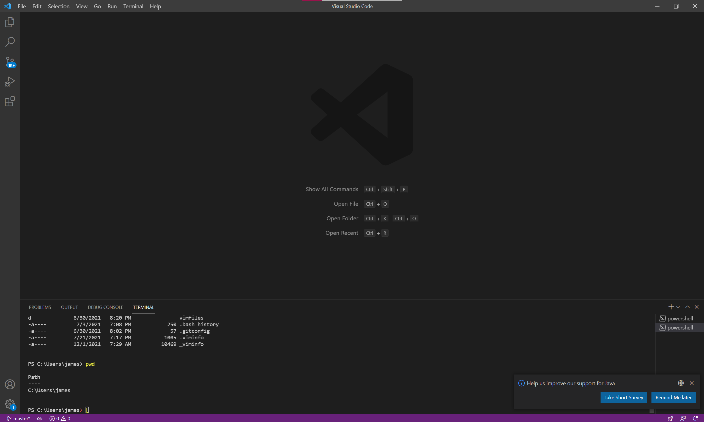
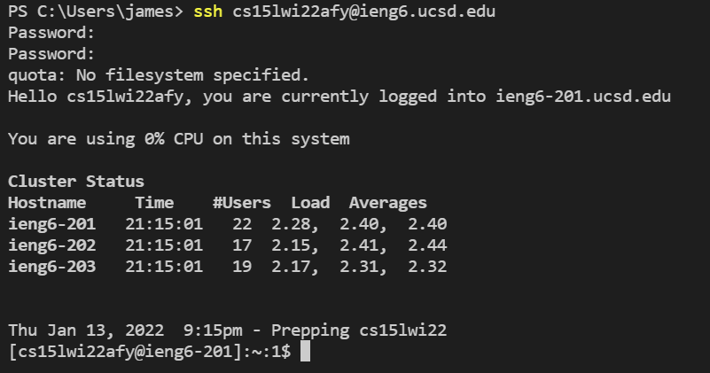
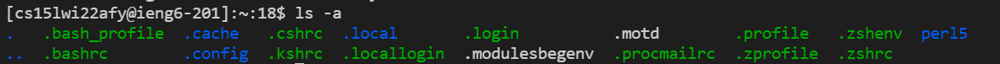
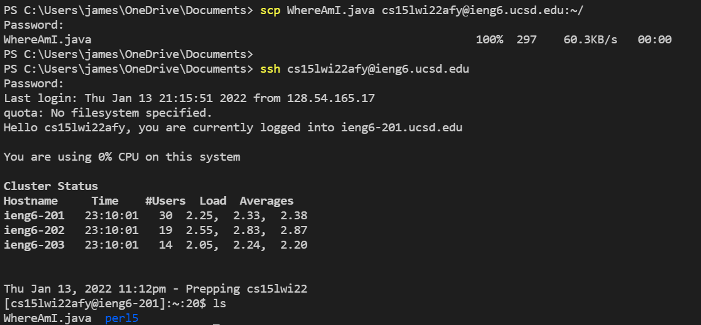
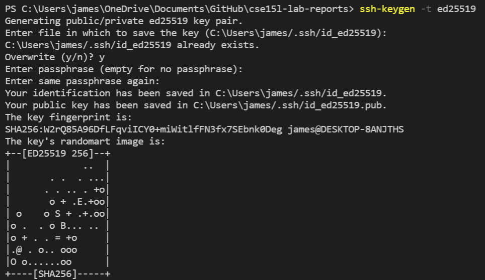
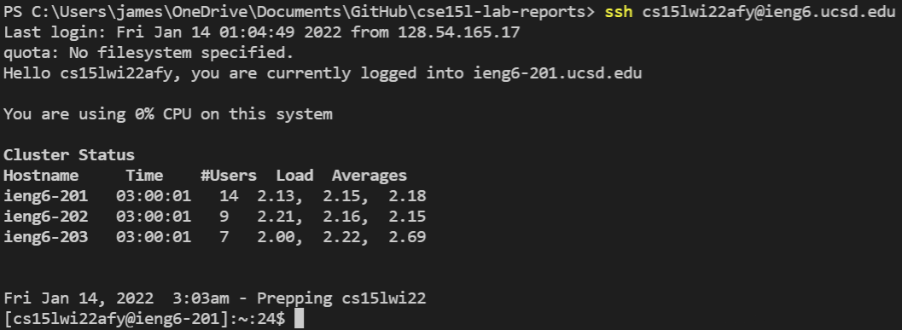
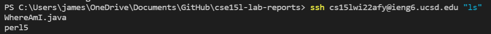
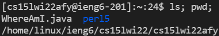

# Tutorial: How to Log into a course-specific account on ieng6

## Installing VScode

To get started we need to download and install vscode. To do this use the following [link](https://code.visualstudio.com/) and follow the directions for installation. Open the application which should look something like the following image.

## Remotely Connecting

Every student is given a course-specific account which you can find with the following [link](https://sdacs.ucsd.edu/~icc/index.php). Follow the directions to find your username and then set your password. You can connect to the server with the following command:

>ssh [username]@ieng6.ucsd.edu

Then enter your password. (It won't show what you are typing)

## Trying Some Commands

Now that you've connected to the server, you can experiment by using some commands like cd, ls, pwd, mkdir, and cp. The commands work as follows
* cd [directory]: moves into the specified directory
* ls: shows all relevant files and directories
* pwd: prints the path to the working directory
* mkdir [directory]: creates new directory
* cp: copies files or directories

## Moving Files with scp

To move files over to the server, use the following command:

>scp [file] [username]@ieng6.ucsd.edu:~/

You will have to enter your password to complete the command. You can see the file by connecting to the server and using the command ls.

## Setting an SSH Key

It can be very time-consuming to have to repeatedly enter your password. To circumvent this, we can use ssh keys. Type the following command:

> ssh-keygen

This will create the file which saves the keys. You will be prompted for a passphrase which you should leave empty. Then, you need to move the file to the server with the following command:

> scp [directory path] [username]@ieng6.ucsd.edu:~/

You should now be able to connect to the server without having to enter your password.

## Optimizing Remote Running

There are some ways you can optimize remote running by doing things like:
* using the up arrow to select previously typed commands
* typing a command in quotes on the same line as you connect to the server to connect, execute the command, and then exit

* Running multiple commands on the same line by separating them by semicolons

