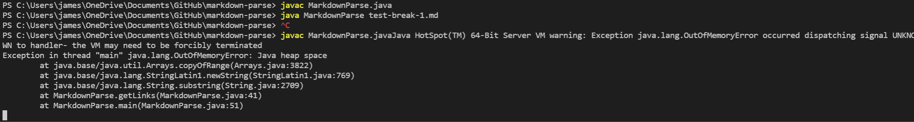
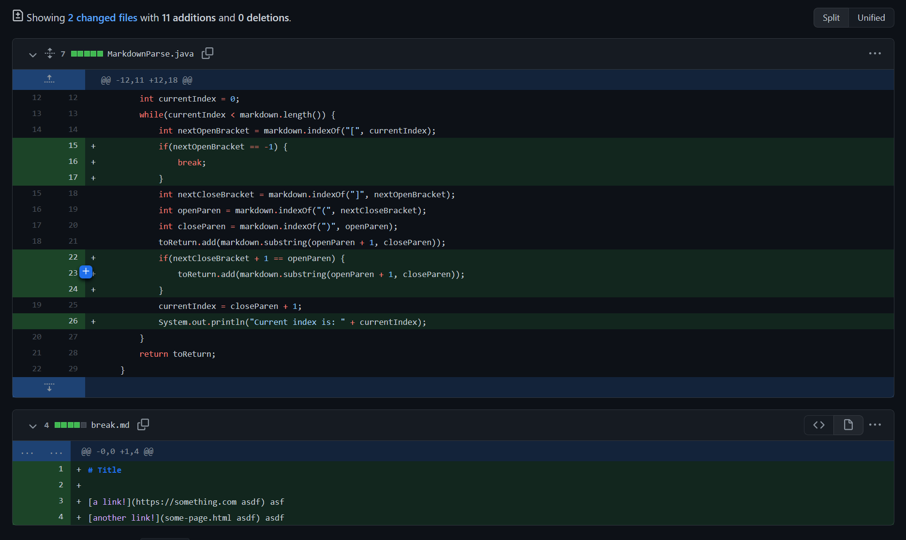
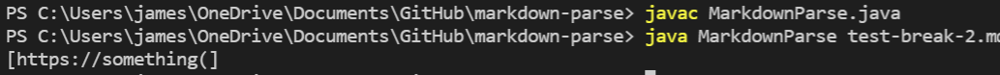
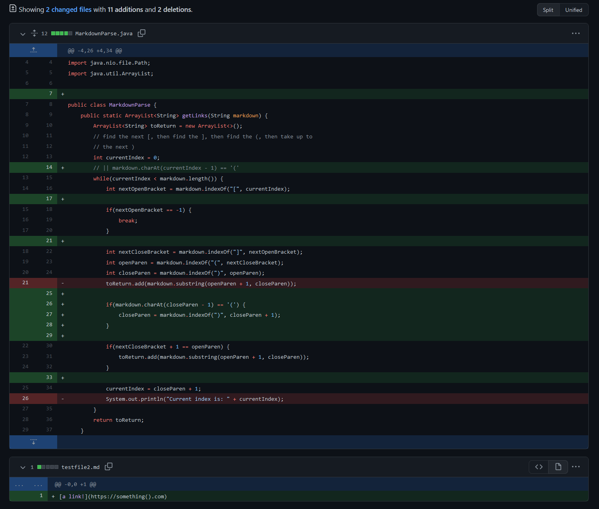
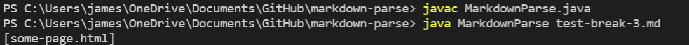
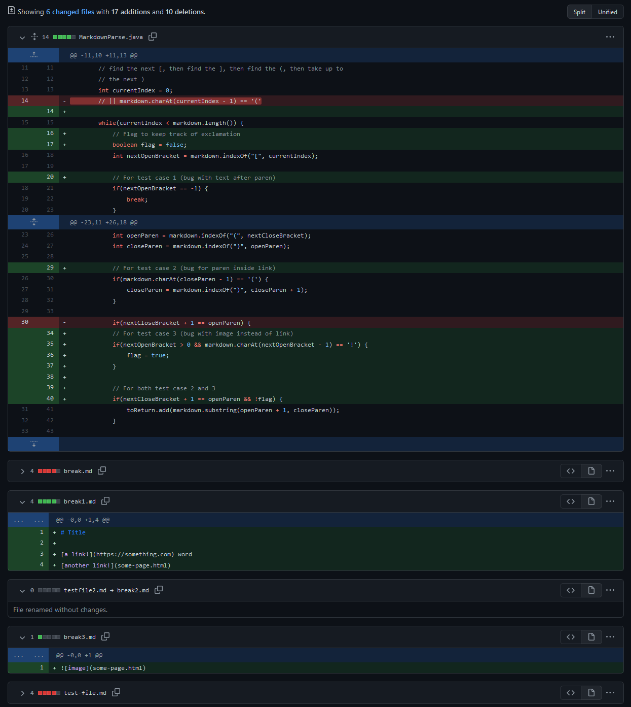

# Lab Report 2: Week 4
# Program Fixes

This program reads a markdown file and then prints out a list of all the links. It has some issues that we can fix.

## Fix 1: Characters after parentheses

The first bug is that the program is not designed to account for any characters after the last set of parentheses. The failure-producing [input](test-break-1.md) has characters after the parentheses. Running the program with this input causes the symptom of an infinite loop.

To fix this problem, we add an if statement that exits the loop if it does not find any more brackets.

## Fix 2: Parentheses in Parentheses

The next bug is the problem that the program cannot account for there being a set of parentheses inside a link. The failure-producing [input](test-break-2.md) has a set of parentheses next to one another inside the set of parentheses that contain the link. This causes the symptom of cutting off the link before the first set of between the parentheses in the link.

We can fix this by checking if the parentheses are right next to one another. If so, then we do not end the link there but look for another closing parenthesis.

## Fix 3: Images

Images are also displayed in markdown files with brackets and parentheses. However, they should not be listed as links. The final bug we are looking at is this issue where the program cannot distinguish between images and links. The failure-inducing [input](test-break-3.md) is just a markdown file with an image. The symptom is that the image will be listed as a link when it is not.

To fix this, we add an if statement that checks for '!' before the brackets. If it finds '!', then the subsequent image is not added to the list of links.

