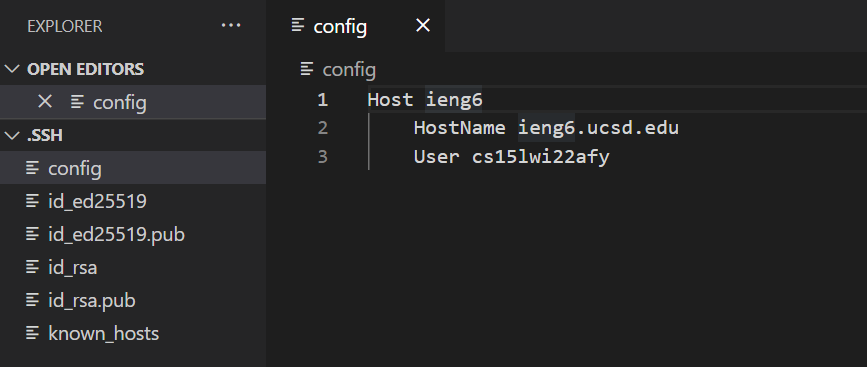
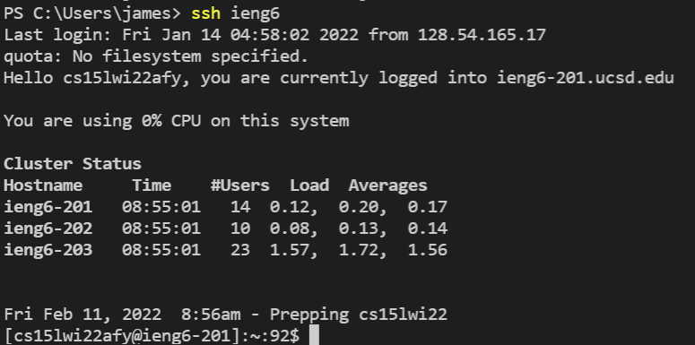
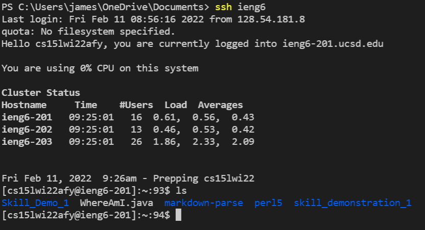

# Lab Report 3: Week 6
# Program Fixes

## Streamlining ssh Configuration

When we log into the ieng server with ```ssh```, we have to type the command:

>```ssh cs15lwi22afy@ieng6.ucsd.edu```

This is a large amount to type and remember for every time that we want to log into the server. So to get aroud this, we can create a ```config``` file in the ```~/.ssh``` folder. This is what the file should look like:



The text after Host (ieng6) is now what we can use in place of the old login. It can also be changed to whatever alias that we want. We can now login to the server with the command:

>```ssh ieng6```



We can also do all of the same commands which includes copying files with ```scp```. Everything is the same except we can now use our new alias.

>```scp [filename] ieng6```


