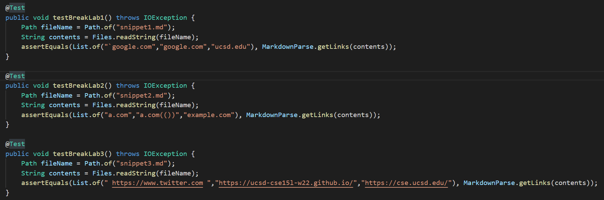
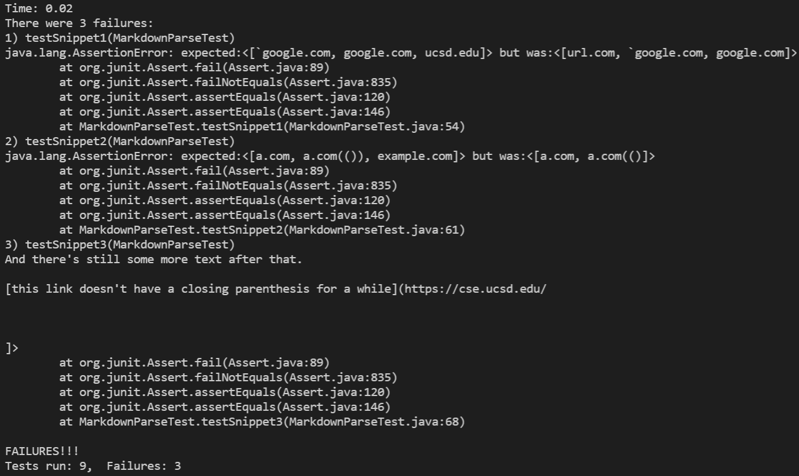
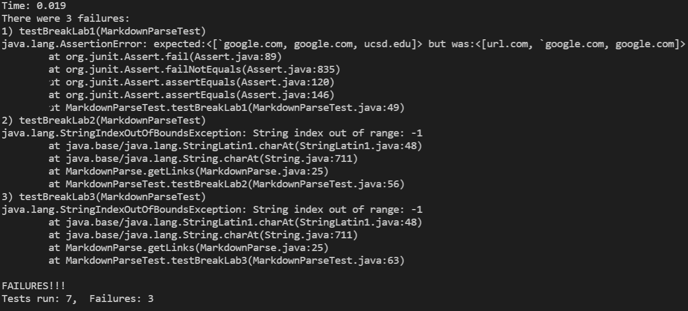

# Lab Report 4: Week 8
# Markdown Snippets

## Markdown Parses

Tests were conducted on the following 2 versions of markdown-parse. The [first](https://github.com/henryzhang03/my-markdown-parse) is our group's implementation and the [second](https://github.com/nakulnandhakumar/markdown-parse) is the implementation that we reviewed as part of lab 7.

## Test Files

Three test files were used to test the programs.

The md file for the first test is


The preview looks like


The expected output for this first test is 
>``` [`google.com, google.com, ucsd.edu]```

The md file for the second test is


The preview looks like


The expected output for this second test is 
>``` [a.com, a.com(()), example.com]```

The md file for the third test is


The preview looks like


The expected output this third test is 
>```[ https://www.twitter.com , https://ucsd-cse15l-w22.github.io/,https://cse.ucsd.edu]```

The additional tests for the ```MarkdownParseTest.java``` file are as follows:



For our group's implementation, none of the tests passed.



For the implementation that we reviewed, none of the new tests passed either.



## Review Questions

```Do you think there is a small (<10 lines) code change that will make your program work for snippet 1 and all related cases that use inline code with backticks? If yes, describe the code change. If not, describe why it would be a more involved change.```

Yes, there is a small code change that could be implemented. The code could be changed so that it does not accept the link if there is an open backtick before the first bracket. This would require keeping count of whether the backtick is open or closed and then when the first bracket is encountered, there would have to be an if statement that checks if the number of backticks is even. If it is, then it counts the following link. If not, then the link is not counted.

```Do you think there is a small (<10 lines) code change that will make your program work for snippet 2 and all related cases that nest parentheses, brackets, and escaped brackets? If yes, describe the code change. If not, describe why it would be a more involved change.```

Yes, there would have to be a counter that was incremented every time there was an open bracket or parenthesis and then decremented every time there was a closed bracket or parenthesis. The following link will not be accepted until the counter is at zero.

```Do you think there is a small (<10 lines) code change that will make your program work for snippet 3 and all related cases that have newlines in brackets and parentheses? If yes, describe the code change. If not, describe why it would be a more involved change.```

I think that with the link that is collected, you could use a string method like replaceAll() to remove all of the whitespace in the collected link before adding it to the list of links. That way, the newlines would not show up in the final link.

