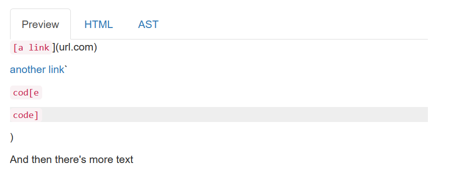
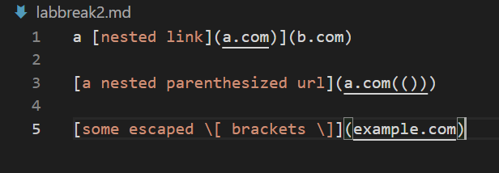
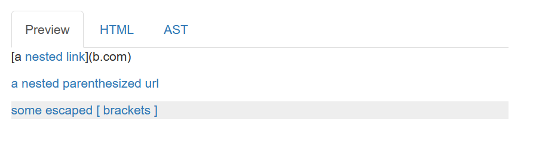
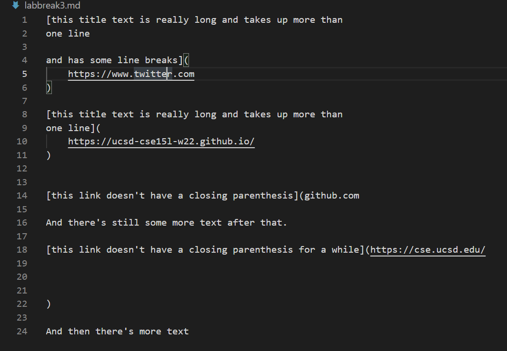
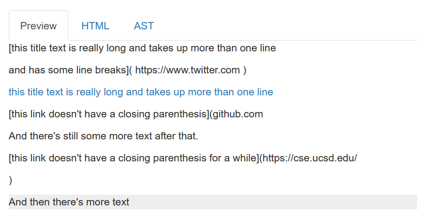
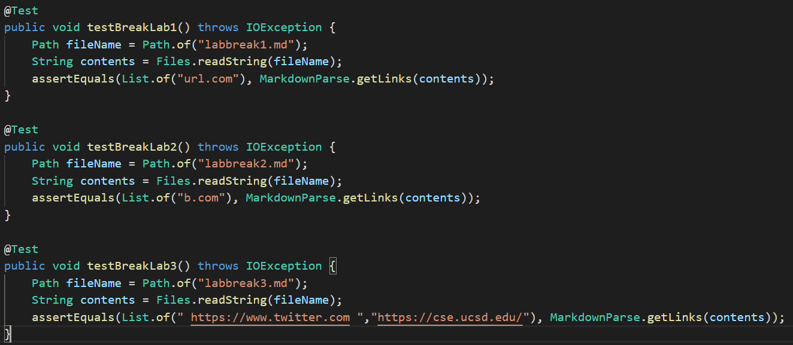
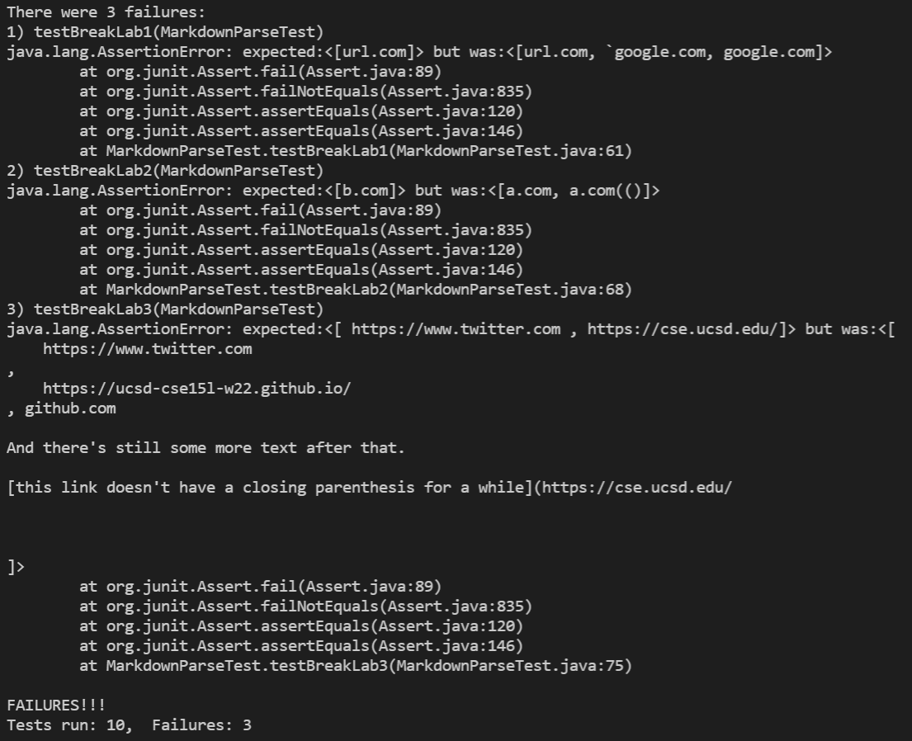
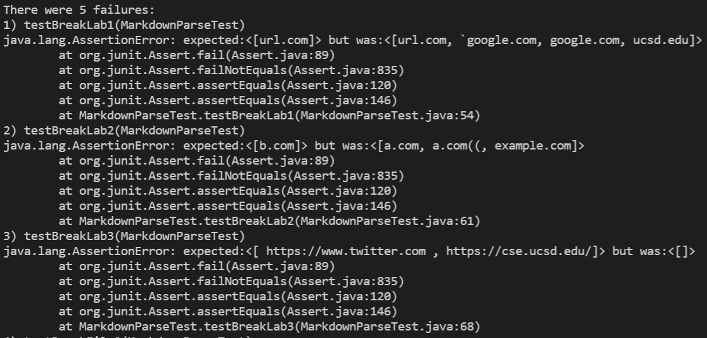

# Lab Report 4: Week 8
# Markdown Snippets

## Markdown Parses

Tests were conducted on the following 2 versions of markdown-parse. The [first](https://github.com/jmcole9/markdown-parse/blob/main/MarkdownParse.java) is my implementation and the [second](https://github.com/ucsd-cse15l-w22/markdown-parse) is the implementation that I was given.

## Test Files

Three test files were used to test the programs.


The preview looks like



The expected output for this first test is 
>[```"url.com"```]



The preview looks like



The expected output for this second test is 
>[```"b.com"```]



The preview looks like



The expected output this last test is 
>[```" https://www.twitter.com "```, ```https://cse.ucsd.edu/```]

The additional tests for the ```MarkdownParseTest.java``` file are as follows:



For my implementation, none of the new tests passed.



For the implementation given in class, none of the new tests passed either.



## Review Questions

```Do you think there is a small (<10 lines) code change that will make your program work for snippet 1 and all related cases that use inline code with backticks? If yes, describe the code change. If not, describe why it would be a more involved change.```

The code could be changed so that it does not accept the link if there is an open backtick before the first bracket. This would require keeping count of whether the backtick is open or closed, but I think it could be done as a relatively small change.

```Do you think there is a small (<10 lines) code change that will make your program work for snippet 2 and all related cases that nest parentheses, brackets, and escaped brackets? If yes, describe the code change. If not, describe why it would be a more involved change.```

It may not be a small code change but the algorithm would need to count the parentheses so if there are, for example, two open parentheses, the algorithm does not stop until there are two closed parentheses. This would require keeping a running count.

```Do you think there is a small (<10 lines) code change that will make your program work for snippet 3 and all related cases that have newlines in brackets and parentheses? If yes, describe the code change. If not, describe why it would be a more involved change.```

I think this kind of code would be more complicated. It would require you to somehow decide when to break brackets or parentheses when dealing with finding new links so it would be a more involved change.

