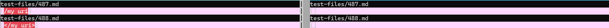
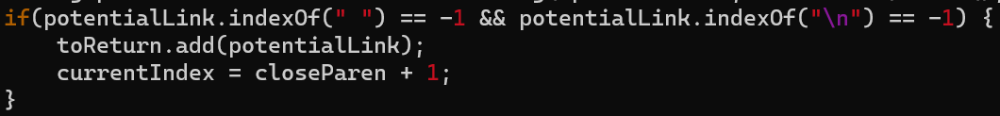
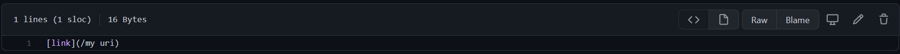
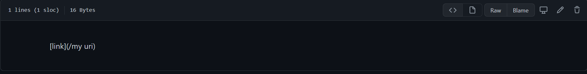
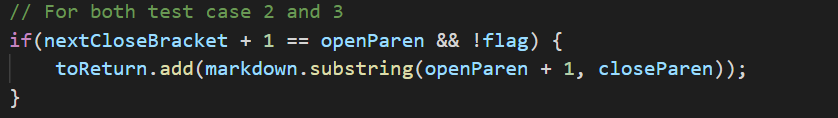
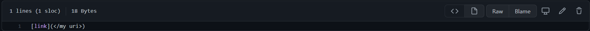
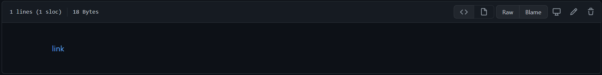

# Lab Report 5: Week 10
# Markdown Comparisons

## Markdown Parses

In the following tests, the output of the two different implimentations of markdown parse differed as follows.

Our implementation is on the left and the implementation given to us in lab is on the right. The results of both markdown-parse implementations on a large number of test files were printed to two separate files. The command vimdiff was then used to compare those text files to see how or if the outputs differed for all of the tests.

## Test 1

The first md file is

and previewed, the file looks like

Since, there is no link in the previewed version, the expected output of markdown-parse should be 

>[]

or an empty set since there are no links. This was not the result of our implementation, but was the result of the given implementation.

The problem with our implementation is that it does not take into account spaces. If within the parentheses there is a space between strings, then the link is not counted unless it has an HTML tag. Therefore, our code needs to check if the link has a space and decide not to add it to the list if it does. This condition should be added to the following if statement in the code:

## Test 2

The second md file is

and previewed, the file looks like

The expected output of markdown-parse should be 

>[my uri]

Both implementations are incorrect as our implementation gives the output [</my uri>] and the given implementation returns an empty set as the output.

The problem with both implementations is that the code does not acknowledge when the links have HTML tags and thus have different rules. Thus, the code needs to be changed so that it checks if the link starts with "</" and ends with ">" and if it does, then it adds the substring that is between these characters. This should be included as a different if statement added after the following.

